## SVN版本控制器入门

### 简介
　　我们在开发过程中可能会遇到这样的情况：今天写了很长的一段代码，觉得不合理，然后删了，第二天突然发现昨天的那段代码才是正确的，那怎么办，也无法撤销删除的代码？团队多人共同开发一个项目，如何多人同时开发一个文件而不会冲突覆盖？自己写项目，如何管理这些项目？如何控制他们的版本？这时我们就需要软件配置管理SCM(software configuration management)。SVN(subversion)是近年来崛起的版本管理工具。
>SVN主要用于解决以下问题：
- 协作开发
- 远程开发
- 版本回退
 
### 工具
>SVN软件属于C/S结构软件，所以在使用时必须安装`服务器端`与`客户端`。  

- 服务器端：[visualSVN](https://www.visualsvn.com/visualsvn/download/)
- 客户端：[tortoiseSVN](https://tortoisesvn.net/downloads.html )

### 安装  
>svn工具下载完成,点击进行安装  

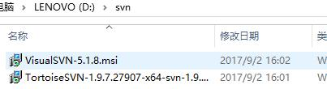
    
>服务器端visualSVN安装步骤如下  
1. 进入visualSVN安装界面,点击next  
	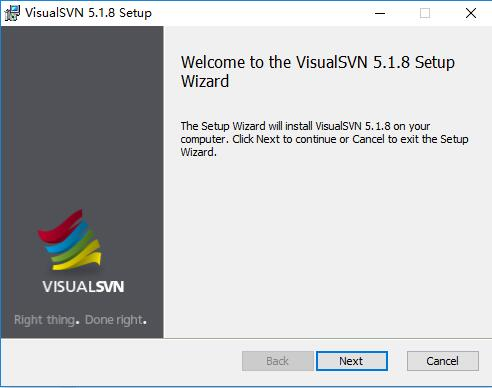  
2. 同意协议，点击next  
	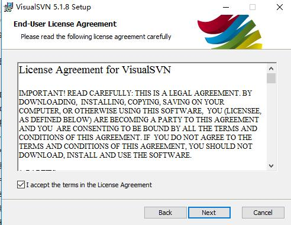  
3. 选择服务器端安装路径，勾选命令行，点击next  
	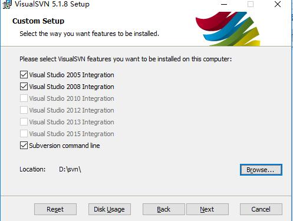  
4. 点击install进行安装，稍等  
	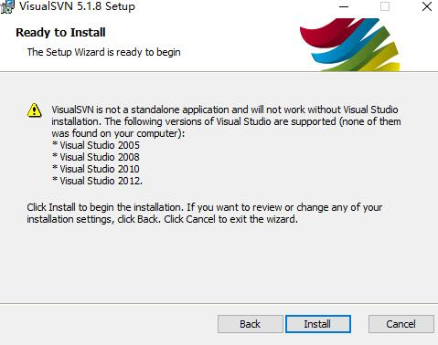  
5.点击finish，完成服务器端安装步骤  
	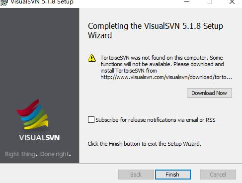  
>客户端tortoiseSVN安装步骤如下  
1. 进入tortoiseSVN安装界面，点击next  
	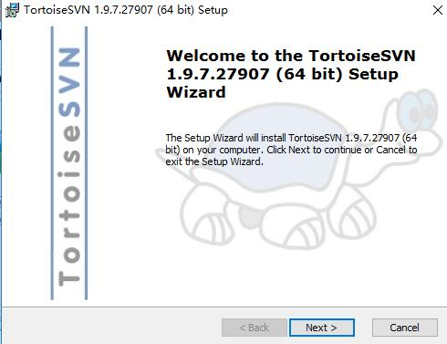  
2. 阅读协议，点击next  
	  
3. 选择客户端安装路径，点击next  
	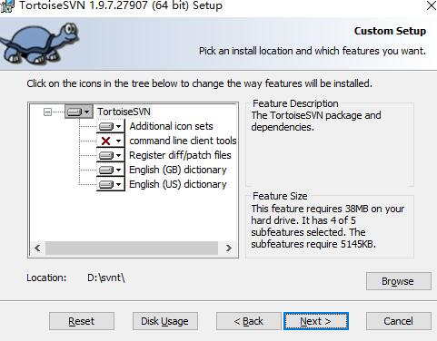  
4. 点击install进行安装，稍等  
	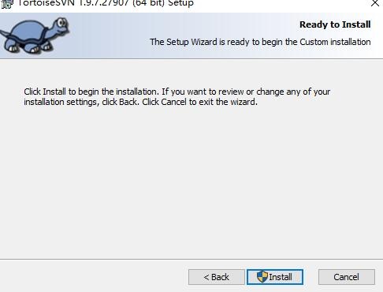  
5. 点击finish，完成客户端安装步骤  
	  
>电脑桌面右键出现svn服务器端与客户端图表，表示安装成功  

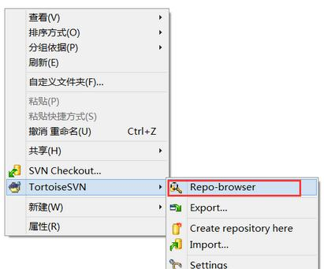  

>注意：安装时，自己的计算机管理员名称必须是英文  
如若不是,更改管理员：控制面板\用户帐户\用户帐户\更改名称

### svn常用操作
1. 在服务器安装路径下建文件夹D:\svn\share\shop  
>上述安装时服务器安装在D:\svn  
share文件夹用于存放所有版本仓库  
shop是版本仓库，此时只是一个普通文件夹，等待创建  

2. 创建仓库  
>DOS窗口执行如下命令  

　　  
>D:\svn\share\shop出现如下所示，则仓库创建成功  

　　 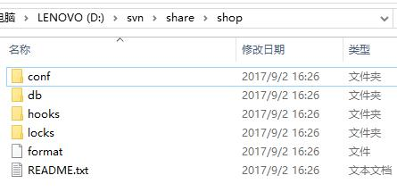  

3. 进行服务器监管  
>DOS窗口执行如下命令  
注意：DOS窗口不能关闭，如果关闭则服务器强行退出  
仓库一旦创建成功，之后对仓库进行操作，只需从这一步骤开始即可  

　　  

4. 文件检出(checkout)  
>在本地建jingli文件夹(最好在Apache服务器根目录，便于文件执行，如：D:\PHP\phpStudy\WWW\jingli)  
只在第一次链接时操作一次，以后有更新用update指令  

- jignli文件夹中右键  
- 选择tortoiseSVN  
- repo-browser  
  >之前监管的是shop，则输入svn://localhost  
  若之前监管的是share，即所有仓库，则此时输入svn://localhost/shop  
- 右键选择svn checkout  
>文件夹中出现.svn文件夹则检出成功  

　　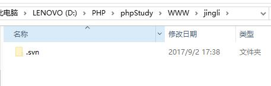  

5. 数据提交(commit)  
>程序员在本地写好程序，要将本地数据提交到服务器端，使用commit指令  

- jingli文件夹空白处右键  
- svn commit  
- 填写commit时的备注信息(必填)  
- 勾选要commit的数据  
- ok  
>注意：打开用户读写权限，否则commit失败  
路径：D:\svn\share\shop\conf\svnserve.conf  

　　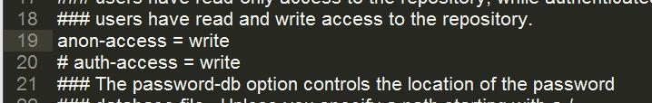  

6. 数据更新(update)  
>每次团队共同开发同一个项目时，使用update指令同步服务器上的数据  

- 程序员自己项目文件夹空白处右键  
- svn update  
- ok  

7. 忽略操作  
- 选中文件  
- 右键tortoiseSVN  
- add to ignore list  
- 确定  
>recursively代表文件夹，后缀意味忽略此类型的文件  

8. 版本回退  
- 本地文件夹空白处右键  
- tortoiseSVN  
- update to version  
- show log  
- 根据日志选择要退回到的版本  
- ok  

9. 版本冲突  
>A、B两人9点同时从服务器update了数据index.php,A 10点commit，B 11点commit，此时B commit时则会版本冲突  

- 冲突如下，点击ok  
　　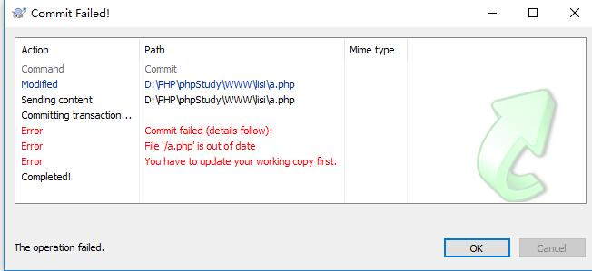  
- 提示是否更新需要，点击update  
　　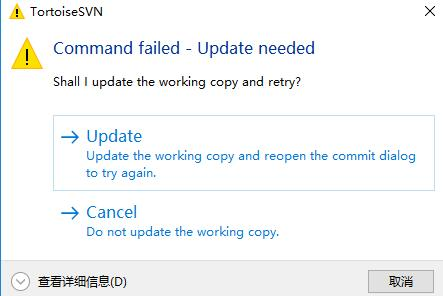  
- 更新完成，点击ok  
　　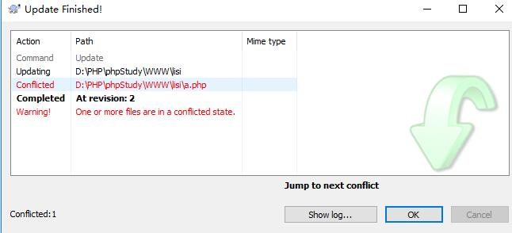  
- 出现如下图，点击cancle  
　　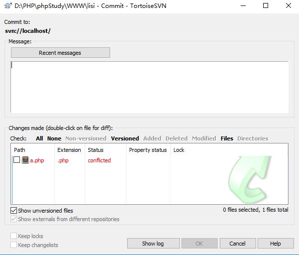  
- 此时B的本地仓库会出现4个相关文件，留下以.php为后缀的文件，删掉其余三个  
　　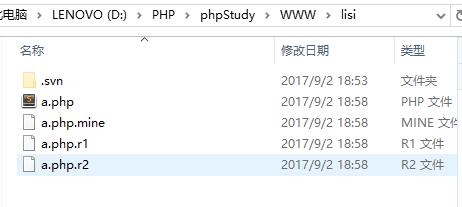 
- 整合此文件，解决冲突，重新提交  

10. 配置多仓库  
- 在SVN中，一个项目就是一个仓库，如果按照之前只对一个仓库进行监管，无法同时开发多个项目  
- 上述我们得知，share文件夹涵盖了所有版本仓库，我们可以监管share目录  
- DOS窗口：svnserve -d -r D://svn/share  
- 此时svn://localhost 指向的就是share  
- svn://localhost/shop 指向的就是我们的仓库  

### 配置与权限  
1. 权限控制  
配置文件路径：D:\svn\share\shop\conf\svnserve.conf  
>注释匿名用户的可读写权限  

　　  
>开启认证文件  

　　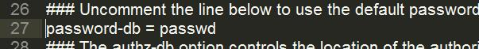  

>开启授权文件  

　　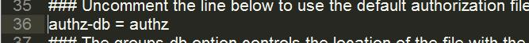  

2. 权限配置  
>编写认证文件定义相关用户名与密码  
配置文件路径：D:\svn\share\shop\conf\passwd  

　　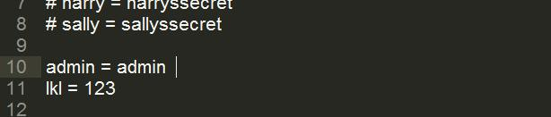  

>编写授权文件  
配置文件路径：D:\svn\share\shop\conf\authz  
创建分组：组名 = 用户1,用户2  

　　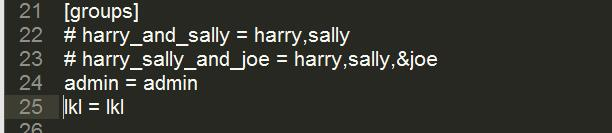  

>配置相关项目,表示项目下具有相关权限,admin组可读写 lkl组可读  匿名用户可读  

　　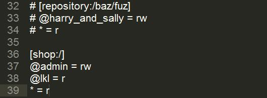  

3. 自启动服务  
>服务器重启后DOS命令就失去作用了，我们要让系统随着Windows启动而启动关闭而关闭  

　　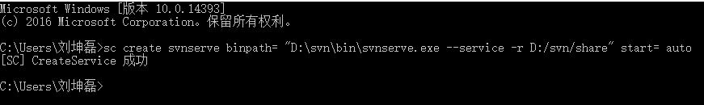  

>启动服务  
控制面板\系统和安全\管理工具\服务  
启动服务后，关闭DOS窗口，能执行svn操作，则自启动服务设置成功  

　　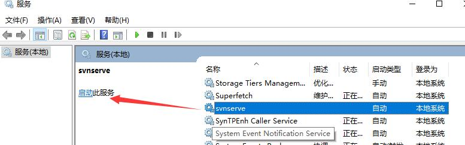  

>如果自启动命令执行失败，出现下面错误  

　　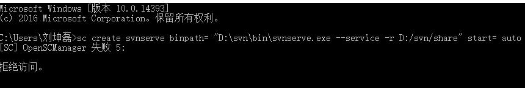  

>解决方法：  
- DOS窗口执行regedit打开注册表
- HKEY_LOCAL_MACHINE  
- Software  
- Microsoft  
- Windows  
- CurrentVersion
- Policies  
- System  
- EnableLUA的值改为0

　　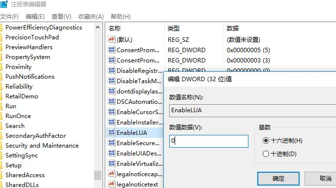  

4. 批处理  
- 启动服务  
>start.bat (net start 服务名称)  

- 停止服务  
>stop.bat (net stop 服务名称)  

- 删除服务  
>delete.bat (sc delete 服务名称)  

5. 钩子程序  
>在D:\PHP\phpStudy\WWW\建shop文件夹检出项目到shop，其他职员在本地提交数据到svn服务器，shop中的文件实时更新  
通过批处理指令编写钩子程序  
路径：D:\svn\share\shop\hooks  
注意：等号前后不要加空格  

- 新建post-commit.bat  
- 设置服务器端svn路径  
>SET SVN = "D:\svn\bin\svn.exe"  

- 设置服务器端项目运行目录  
>SET DIR = "D:\PHP\phpStudy\WWW\shop"  

- 通过update指令实时更新数据到DIR目录中  
>SVN update %DIR%  

- bat编写完成后点击运行即可  

　　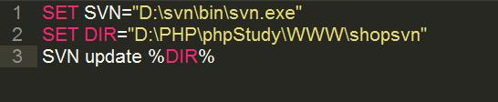  

